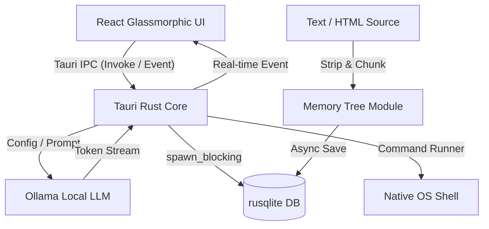

# ✦ JARvis: Native Local Desktop AI Agent

<div align="center">
  <p align="center">
    <strong>A high-performance, local-first AI desktop agent built with Rust, Tauri v2, and React.</strong><br />
    Private ReAct reasoning loops, secure native tools, and dynamic token-compressed SQLite memory.
  </p>
  
  <p align="center">
    <a href="#-key-features">Features</a> •
    <a href="#-architecture">Architecture</a> •
    <a href="#-tech-stack">Tech Stack</a> •
    <a href="#-getting-started">Getting Started</a> •
    <a href="#-design-system">Design System</a>
  </p>
</div>

---

## ⚡ Core Philosophy

**JARvis** brings secure, powerful agentic capabilities directly to your desktop. Unlike cloud-dependent AI tools, JARvis operates **100% locally** on your machine. Using local LLMs (via Ollama), it can securely read/write files, run approved shell commands, and compress high-density information into a local SQLite-backed **Memory Tree**—all without your data ever leaving your device.

---

## 🌟 Key Features

### 1. Offline ReAct Reasoning Loop
- Executes autonomous **Reasoning-Action-Observation** loops.
- Self-corrects tool errors, breaks down complex instructions into sequential sub-tasks, and streams thinking logs in real time.

### 2. Local Memory Tree & Token Compression
- **Tag-Stripping Engine**: Raw HTML and bloated texts are automatically stripped of markup and non-ASCII glyphs to form pristine, minimal Markdown.
- **Word-Level Tokenizer**: Estimate counts dynamically on the native side (`1 word ≈ 1.3 tokens`).
- **SQLite Chunking Layer**: Automatically chunks massive payloads into `3,000` token slices using an asynchronous thread-pool (`tokio::task::spawn_blocking`), providing near-instant indexing and retrieval.

### 3. Native OS Integration & Safety
- **Approved Commands**: Integrated shell runner with custom allowlists to prevent dangerous command execution.
- **SQLite Audit Logs**: Every conversation, message, and tool invocation is audited and securely persisted locally.

### 4. Cinematic Glassmorphic Interface
- **Premium Aesthetics**: Dark theme optimized for visual comfort, vibrant electric-violet glow accents (`--glow-primary`), and frosted-glass panels (`backdrop-filter`).
- **Interactive Tool Drawer**: Slide-out activity panel displaying active tool runs, arguments, exit statuses, and return outputs.
- **Sharp Typography**: Modern geometric display headings via `Syne` paired with highly readable monospaced blocks using `JetBrains Mono`.

---

## 📐 Architecture

JARvis uses a robust multi-threaded design bridging native system execution with a sandboxed frontend:



---

## 🛠️ Tech Stack

### Native Backend (Rust)
- **Framework**: [Tauri v2](https://v2.tauri.app/) — lightweight, secure web view bindings.
- **Asynchronous Runtime**: [Tokio](https://tokio.rs/) — multi-threaded task management.
- **Local Storage**: [Rusqlite](https://github.com/rusqlite/rusqlite) — embedded SQLite database with Write-Ahead Logging (WAL) enabled.
- **HTTP Client**: [Reqwest](https://github.com/seanmonstar/reqwest) — streaming Ollama token chunks.

### Client Frontend (TypeScript & React)
- **Core**: [React 19](https://react.dev/) + [Vite](https://vite.dev/) — extremely fast hot reloading.
- **Global State**: [Zustand](https://github.com/pmndrs/zustand) — lightweight, reactive stores.
- **Styling**: Vanilla CSS Modules — granular, token-driven custom styles with zero utility bloat.
- **Icons & Fonts**: Google Fonts (`Syne`, `Inter`, `JetBrains Mono`).

---

## 📂 Repository File Structure

```text
JARvis/
├── src-tauri/                 # Native Rust Application
│   ├── src/
│   │   ├── agent/             # LLM provider interface & ReAct agent loops
│   │   ├── commands/          # Tauri IPC command controllers (chat, memory, settings)
│   │   ├── db/                # SQLite initialization & database migrations
│   │   ├── errors.rs          # Centralized Rust error models
│   │   ├── lib.rs             # Tauri builder orchestration & module registration
│   │   ├── main.rs            # Binary entry point
│   │   ├── memory.rs          # Token compression & Memory Tree database layer
│   │   └── state.rs           # Shared state manager (mutex db connection, cancel tokens)
│   └── Cargo.toml             # Rust dependencies (serde, rusqlite, tokio, reqwest)
├── src/                       # React Frontend
│   ├── assets/                # Core brand static assets
│   ├── components/            # Reusable UI component tree
│   │   ├── agent/             # ToolActivity & execution logs
│   │   ├── chat/              # ChatView, MessageBubbles, and InputBar
│   │   └── layout/            # TitleBar, Sidebar, and Modals
│   ├── hooks/                 # Custom React hooks (useChat handles streaming state)
│   ├── lib/                   # IPC wrappers for Tauri API integration
│   ├── store/                 # Zustand store (app state & settings)
│   ├── index.css              # Global layout, variables, and animations
│   └── main.tsx               # Client bootstrap entry point
├── package.json               # Frontend dependencies & package commands
└── tauri.conf.json            # Tauri v2 system & permission configurations
```

---

## 🚀 Getting Started

### Prerequisites
Make sure you have the following installed on your machine:
1. [Node.js](https://nodejs.org/) (v18 or higher)
2. [Rust / Cargo Compiler](https://www.rust-lang.org/tools/install)
3. **Windows Users**: Visual Studio Build Tools with C++ workload.
4. [Ollama Desktop](https://ollama.com/) (running locally)

### Setup Instructions

1. **Clone the repository**:
   ```bash
   git clone https://github.com/yourusername/JARvis.git
   cd JARvis
   ```

2. **Install frontend dependencies**:
   ```bash
   npm install
   ```

3. **Pull a local LLM model**:
   Make sure Ollama is open and running, then pull the default model:
   ```bash
   ollama pull llama3
   ```
   *(Alternatively, pull a lightweight model like `ollama pull qwen2.5:0.5b` and change the selected model in Settings).*

4. **Launch the application in development mode**:
   ```bash
   npm run tauri dev
   ```
   Tauri will compile the native Rust backend, start the Vite development server, and open the JARvis desktop frame.

---

## 🎨 Design System & CSS Variables

JARvis features an **Awwwards-inspired cinematic aesthetic**. The styling resides entirely in `src/index.css` utilizing cohesive, CSS custom properties:

* **Pure Cinema Black** (`--bg-base: #050507`): Deep, non-fatiguing backdrop layer.
* **Electric Violet Glow** (`--accent-primary: #8a76ff`): Prominent highlight accents.
* **Ice Teal Secondary** (`--accent-secondary: #00e5b8`): Tool action success states.
* **Glass Panels** (`.glass`): Combines `rgba` transparency, `backdrop-filter: blur(20px)`, and a micro-thin border (`rgba(255,255,255,0.07)`).

---

## 🔒 Safety & Privacy Guarantee

JARvis is built on privacy first.
* All conversations and tool executions are saved in an **unencrypted, local SQLite file** (`jarvis.db`) under your OS `AppData` directory.
* No telemetry, no usage logs, and no prompt contents are sent to external analytics companies.

---

## 📄 License
This project is open-source under the [MIT License](LICENSE).
