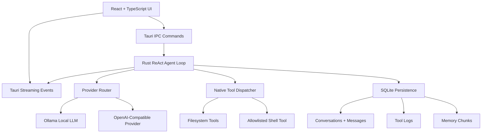

# ✦ JARvis: Native Local Desktop AI Agent

<div align="center">
  <p align="center">
    <strong>A high-performance, local-first AI desktop agent built with Rust, Tauri v2, and React.</strong><br />
    Private ReAct reasoning loops, secure native tools, and dynamic token-compressed SQLite memory.
  </p>
  
  <p align="center">
    <a href="#-key-features">Features</a> •
    <a href="#-architecture">Architecture</a> •
    <a href="#-tech-stack">Tech Stack</a> •
    <a href="#-getting-started">Getting Started</a> •
    <a href="#-design-system">Design System</a>
  </p>
</div>

---
## Native Desktop AI Agent Platform

JARvis is a local-first desktop AI agent platform built with Rust, Tauri v2, React, TypeScript, SQLite, and streaming LLM providers. The app is designed to run private local agents through Ollama while also supporting OpenAI-compatible premium model providers for higher capability workflows.

The current build includes a working ReAct-style agent loop, local conversation persistence, native filesystem and shell tools, live token streaming, local memory commands, provider settings, OS-backed secure credential storage, workspace-scoped filesystem permissions, a persisted multi-agent foundation, CI, automated tests, and packaged Windows desktop installers.

---

## Current Status

This repository has been reviewed, fixed, and successfully built as a desktop app.

Verified commands:

```bash
npm run build
cargo check
cargo test
npm run tauri build
```

Generated desktop artifacts:

```text
src-tauri/target/release/jarvis.exe
src-tauri/target/release/bundle/msi/JARvis_0.1.0_x64_en-US.msi
src-tauri/target/release/bundle/nsis/JARvis_0.1.0_x64-setup.exe
```

Local development preview:

```bash
npm run tauri dev
```

The Vite dev server runs at:

```text
http://localhost:1420/
```

---

## What Was Reviewed

The review covered the frontend, backend, native tool execution, database layer, settings flow, and build path.

Reviewed areas:

- React app shell and chat workflow.
- Zustand app state and streaming state management.
- Tauri IPC wrappers and event listeners.
- Rust ReAct agent loop.
- Ollama streaming provider.
- Provider selection logic.
- SQLite schema, migrations, conversations, messages, settings, and tool logs.
- Filesystem and shell tools.
- Tauri packaging and Windows installer generation.

Initial verification showed:

- Frontend TypeScript/Vite build was passing.
- Rust `cargo check` was passing.
- Several runtime and product-level issues still existed despite the clean compile.

---

## What Was Solved

### 1. Provider Setting Was Ignored

Problem:

The settings model had a `provider` field, but the backend always used Ollama. This meant the app could not actually switch to OpenAI or other premium models.

Solution:

- Added provider routing in the Rust agent command.
- Added an `OpenAiCompatibleProvider`.
- Kept Ollama as the default local provider.
- Added OpenAI-compatible settings fields for base URL, API key, and model.

Supported provider modes now:

- `ollama`
- `openai_compatible`

OpenAI-compatible mode can work with:

- OpenAI Chat Completions-compatible endpoints.
- OpenAI-compatible gateways such as OpenRouter or similar providers.
- Local or hosted servers that implement `/chat/completions`.

Relevant files:

```text
src-tauri/src/agent/llm.rs
src-tauri/src/commands/agent_ctrl.rs
src-tauri/src/db/models.rs
src-tauri/src/db/mod.rs
src/components/settings/SettingsModal.tsx
src/types/index.ts
```

### 2. OpenAI/Premium Model Settings Were Missing

Problem:

The UI only exposed Ollama configuration even though the platform goal includes OpenAI and premium models.

Solution:

Added settings UI for:

- Provider selector.
- OpenAI-compatible base URL.
- OpenAI-compatible model name.
- API key field.

The API key can be saved locally or omitted to use the `OPENAI_API_KEY` environment variable.

Important security note:

API keys saved through the current settings UI are stored in the local SQLite database. This is local-only, but it is not encrypted yet. Encryption should be added in the next phase before treating this as production-grade credential storage.

### 3. Assistant Message Reload Race

Problem:

The frontend listened for the `jarvis:done` event and immediately reloaded messages. The backend emitted `jarvis:done` before the assistant response was inserted into SQLite. That created a race where the final assistant message could be missing from the UI until a later refresh.

Solution:

- Changed the frontend flow so `jarvis:done` only resets streaming UI state.
- Message reload now happens after the `send_message` IPC call resolves, which means persistence has completed.
- The conversation ID is captured before sending so switching conversations during a run does not reload the wrong thread.

Relevant file:

```text
src/hooks/useChat.ts
```

### 4. Tool Logs Were Not Persisted

Problem:

The database had a `tool_logs` table and frontend types, but tool execution records were only emitted as events. They were not saved.

Solution:

- Added `ToolRunRecord`.
- Changed the agent loop to return an `AgentRunResult` containing final response, iteration count, and tool runs.
- Persisted each tool call into SQLite after the assistant message is saved.

This makes the audit trail real instead of only visual.

Relevant files:

```text
src-tauri/src/agent/mod.rs
src-tauri/src/commands/agent_ctrl.rs
src-tauri/src/db/mod.rs
```

### 5. Shell Tool Security Was Too Loose

Problem:

The shell tool allowed commands by binary name even if the command string included a path. For example, allowing `python` could accidentally permit a different executable named `python` from an arbitrary path.

Solution:

- If the command contains a path separator, it must match the allowlist exactly.
- Binary-name allowlisting only applies to plain command names.
- Added a hard 60-second timeout so agent-run commands cannot hang forever.

Relevant file:

```text
src-tauri/src/tools/shell_tools.rs
```

### 6. Ollama Stream Parsing Could Drop Final Data

Problem:

The Ollama stream parser processed newline-delimited chunks. If the final chunk did not end with a newline, remaining buffered data could be ignored.

Solution:

- Added trailing-buffer parsing after the stream ends.

Relevant file:

```text
src-tauri/src/agent/llm.rs
```

### 7. Desktop Build Path Was Verified

Problem:

The app needed to be proven beyond the frontend build.

Solution:

- Ran the full Tauri production build.
- Confirmed the app binary and installers are generated.

Build output:

```text
src-tauri/target/release/jarvis.exe
src-tauri/target/release/bundle/msi/JARvis_0.1.0_x64_en-US.msi
src-tauri/target/release/bundle/nsis/JARvis_0.1.0_x64-setup.exe
```

### 8. Plaintext Premium API Key Storage Was Removed

Problem:

The settings model allowed the OpenAI-compatible API key to be stored in the SQLite settings table.

Solution:

- Added OS secure credential storage through the Rust `keyring` crate.
- `save_settings` now stores non-empty OpenAI-compatible API keys in the OS credential store.
- The SQLite `openai_api_key` settings value is sanitized to an empty string.
- `get_settings` reports whether a secure key exists without returning the secret to the frontend.
- Added a `clear_openai_api_key` command.
- Added a test proving plaintext API keys are not stored in SQLite.

Relevant files:

```text
src-tauri/src/credentials.rs
src-tauri/src/commands/settings.rs
src-tauri/src/db/mod.rs
src/components/settings/SettingsModal.tsx
```

### 9. Workspace-Scoped Filesystem Permissions Were Added

Problem:

Filesystem tools could read, write, list, or check any path the process had OS access to.

Solution:

- Added `workspace_roots` to settings.
- Filesystem tools now validate requested paths against configured workspace roots.
- Relative paths are resolved before validation.
- Writes validate the nearest existing parent before creating files/directories.
- Added tests proving reads outside the workspace are denied and writes inside the workspace are allowed.

Relevant files:

```text
src-tauri/src/tools/fs_tools.rs
src-tauri/src/tools/mod.rs
src-tauri/src/db/models.rs
src/components/settings/SettingsModal.tsx
```

### 10. Multi-Agent Persistence Foundation Was Added

Problem:

The product goal includes multi-agent orchestration, but there was no persisted agent registry or run history model.

Solution:

- Added `agents` and `agent_runs` tables.
- Seeded default specialist agents: Coordinator, Researcher, Builder, and Reviewer.
- Added backend commands for listing agents and agent run history.
- Added TypeScript IPC wrappers and shared frontend types.

This is the foundation for the next orchestration engine. The agents are now real persisted entities, not only a future README concept.

Relevant files:

```text
src-tauri/src/db/models.rs
src-tauri/src/db/mod.rs
src-tauri/src/commands/multi_agent.rs
src/lib/ipc.ts
src/types/index.ts
```

### 11. CI and Automated Tests Were Added

Problem:

The repository had no automated verification pipeline.

Solution:

- Added GitHub Actions workflow for Windows.
- CI runs `npm ci`, `npm run build`, `cargo check --locked`, and `cargo test --locked`.
- Added Rust tests for memory processing, DB migrations/settings, shell command safety, and workspace filesystem boundaries.

Relevant file:

```text
.github/workflows/ci.yml
```

---

## Current Capabilities

### Local LLM Agents

JARvis can use Ollama as the default local model provider.

Default local settings:

```text
Provider: ollama
Base URL: http://localhost:11434
Model: llama3
```

Recommended local model setup:

```bash
ollama pull llama3
```

You can also use smaller or stronger local models depending on the machine:

```bash
ollama pull qwen2.5:0.5b
ollama pull mistral
ollama pull llama3.1
```

### OpenAI-Compatible Premium Models

JARvis now supports OpenAI-compatible streaming chat providers.

Default premium settings:

```text
Provider: openai_compatible
Base URL: https://api.openai.com/v1
Model: gpt-4.1-mini
API Key: saved in Settings or read from OPENAI_API_KEY
```

This provider path sends requests to:

```text
/chat/completions
```

The app uses plain ReAct JSON tool calls rather than native provider-specific tool calling. This keeps the agent loop portable across Ollama, OpenAI, and compatible gateways.

### ReAct Agent Loop

The agent follows this cycle:

```text
Reason -> Act -> Observe -> Repeat -> Finish
```

Available tools:

```text
read_file
write_file
list_dir
file_exists
run_command
finish
```

The LLM is instructed to call one tool at a time using JSON:

```json
{"tool":"read_file","args":{"path":"README.md"}}
```

### Local Persistence

SQLite stores:

- Conversations.
- Messages.
- Settings.
- Tool logs.
- Memory chunks.

The database lives under the app data directory as:

```text
jarvis.db
```

### Memory Commands

The backend includes memory commands for:

- Compressing raw text into cleaner markdown.
- Chunking text into token-sized slices.
- Storing memory chunks.
- Retrieving memory chunks.
- Removing memory by source.

Current memory is functional at the command layer, but it is not yet fully integrated into the agent retrieval loop.

---

## Architecture



---

## Tech Stack

### Native Backend

- Rust
- Tauri v2
- Tokio
- Reqwest
- Rusqlite
- SQLite WAL mode
- Serde

### Frontend

- React 19
- TypeScript
- Vite
- Zustand
- CSS Modules

### Local AI

- Ollama
- Any locally installed model exposed through Ollama

### Premium AI

- OpenAI-compatible `/chat/completions` streaming providers
- API key from Settings or `OPENAI_API_KEY`

---

## Getting Started

### Prerequisites

Install:

- Node.js 18 or newer.
- Rust and Cargo.
- Visual Studio Build Tools with C++ workload on Windows.
- Ollama if using local models.

### Install Dependencies

```bash
npm install
```

### Run Local Development App

```bash
npm run tauri dev
```

This starts:

- Vite dev server at `http://localhost:1420/`.
- Tauri desktop shell.
- Rust backend in development mode.

### Build Frontend Only

```bash
npm run build
```

### Check Rust Backend

```bash
cd src-tauri
cargo check
```

### Build Desktop Installers

```bash
npm run tauri build
```

Outputs:

```text
src-tauri/target/release/jarvis.exe
src-tauri/target/release/bundle/msi/JARvis_0.1.0_x64_en-US.msi
src-tauri/target/release/bundle/nsis/JARvis_0.1.0_x64-setup.exe
```

---

## Using Ollama

1. Start Ollama.
2. Pull a model:

```bash
ollama pull llama3
```

3. Open JARvis Settings.
4. Set:

```text
Provider: Ollama Local
Base URL: http://localhost:11434
Model: llama3
```

5. Save settings and start a new conversation.

---

## Using OpenAI-Compatible Models

1. Open JARvis Settings.
2. Set:

```text
Provider: OpenAI Compatible
Base URL: https://api.openai.com/v1
Model: gpt-4.1-mini
```

3. Add an API key in the API Key field, or launch the app with:

```bash
set OPENAI_API_KEY=your_key_here
npm run tauri dev
```

PowerShell:

```powershell
$env:OPENAI_API_KEY="your_key_here"
npm run tauri dev
```

4. Save settings and send a message.

---

## Safety Model

Current safety controls:

- Shell commands must be allowlisted.
- Path-based commands must match the allowlist exactly.
- Shell commands timeout after 60 seconds.
- Filesystem tools are restricted to configured workspace roots.
- OpenAI-compatible API keys are stored through the OS secure credential store.
- Tool runs are persisted to SQLite.
- No telemetry is implemented.

Current limitations:

- There is no per-run approval prompt for high-risk file writes or shell commands.
- Agent cancellation does not yet interrupt an active network stream or running process immediately.
- Multi-agent orchestration has a persisted foundation, but the planner/executor loop is still a next-phase task.

Recommended next safety upgrades:

- Add per-tool user approval for destructive actions.
- Add command risk classification.
- Add cancellation-aware provider streaming and process execution.

---

## Next Phase Roadmap

### Phase 1: Stabilize the Agent Runtime

Goal:

Make single-agent execution dependable enough for daily use.

Work items:

- Add robust structured tool-call parsing instead of relying on a single JSON line.
- Add retries for transient provider/network failures.
- Add cancellation support inside streaming providers.
- Add cancellation support for running shell commands.
- Add per-run IDs to all events so multiple conversations cannot cross streams.
- Add automated backend tests for provider selection, tool logging, and settings migration.
- Add frontend tests for message reload timing and settings persistence.

### Phase 2: Production-Grade Provider Layer

Goal:

Make JARvis a serious local and premium model platform.

Work items:

- Add provider registry abstraction.
- Add provider health checks.
- Add model discovery for Ollama.
- Add configurable temperature, max tokens, context window, and timeout.
- Add separate profiles for local, fast, reasoning, coding, and long-context models.
- Add OpenAI Responses API support if needed.
- Add Anthropic, Gemini, Groq, Mistral, OpenRouter, and LM Studio adapters.
- Add fallback routing: local first, premium fallback, or premium first.
- Add cost and token accounting for paid models.

### Phase 3: Real Multi-Agent Orchestration

Goal:

Move from one agent pretending to be multiple roles into true multi-agent execution.

Proposed agents:

- Coordinator agent: breaks down the user objective and assigns work.
- Research agent: gathers context from files, memory, and tools.
- Builder agent: writes or changes code/artifacts.
- Reviewer agent: audits output for bugs, safety, and quality.
- Memory agent: extracts durable knowledge and updates memory.

Work items:

- Add an `agents` table.
- Add an `agent_runs` table.
- Add an `agent_messages` table.
- Add role-specific system prompts.
- Add a task graph with dependencies.
- Add parallel agent execution where safe.
- Add handoff summaries between agents.
- Add consensus/review before final output.
- Add UI for viewing each agent's workstream.
- Add controls for single-agent, sequential multi-agent, and parallel multi-agent modes.

### Phase 4: Memory and Retrieval

Goal:

Turn the Memory Tree into active agent context rather than passive storage.

Work items:

- Add embeddings for memory chunks.
- Add local vector search.
- Add source-aware retrieval.
- Add conversation summarization.
- Add long-term project memory.
- Add memory pinning and deletion UI.
- Add memory confidence/source metadata.
- Inject retrieved memory into the agent loop with token budgeting.

### Phase 5: Tool Platform

Goal:

Make tools safer, richer, and extensible.

Work items:

- Add tool manifest definitions.
- Add typed schemas for tool inputs and outputs.
- Add per-tool permissions.
- Add user approval prompts for risky tools.
- Add browser automation tool.
- Add Git tool.
- Add package manager tool.
- Add code search tool.
- Add document/spreadsheet tool integrations.
- Add sandboxed workspaces for file edits.

### Phase 6: World-Class Product Experience

Goal:

Make the app feel like a polished agent operating system rather than a demo.

Work items:

- Add command palette.
- Add model/provider status indicator.
- Add run timeline.
- Add durable tool history panel.
- Add conversation search.
- Add project/workspace switcher.
- Add onboarding for Ollama and OpenAI-compatible setup.
- Add keyboard shortcuts.
- Add error recovery UI.
- Add responsive layout polish.
- Add accessibility review.
- Add signed installer workflow.

---

## Known Limitations

- The app currently supports OpenAI-compatible chat streaming, not every provider's native API format.
- Multi-agent orchestration is not yet implemented as separate concurrent agents.
- Memory storage exists, but automatic retrieval into the main agent loop is still a next-phase task.
- Saved API keys are local but not encrypted.
- There is no CI pipeline yet.
- There is no automated test suite yet.

---

## Repository Structure

```text
JARvis/
├── src-tauri/
│   ├── src/
│   │   ├── agent/
│   │   │   ├── llm.rs
│   │   │   └── mod.rs
│   │   ├── commands/
│   │   ├── db/
│   │   ├── tools/
│   │   ├── errors.rs
│   │   ├── lib.rs
│   │   ├── memory.rs
│   │   └── state.rs
│   ├── capabilities/
│   ├── Cargo.toml
│   └── tauri.conf.json
├── src/
│   ├── components/
│   │   ├── agent/
│   │   ├── chat/
│   │   ├── layout/
│   │   └── settings/
│   ├── hooks/
│   ├── lib/
│   ├── store/
│   ├── types/
│   ├── App.tsx
│   └── main.tsx
├── public/
├── package.json
├── tsconfig.json
├── vite.config.ts
└── README.md
```

---

## License

This project is open-source under the Apache License.
